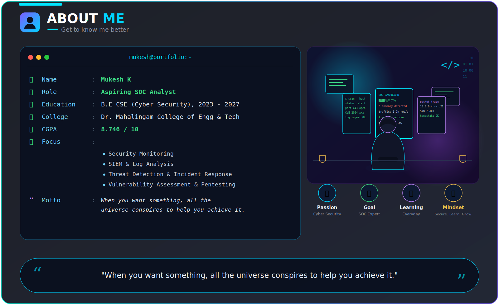
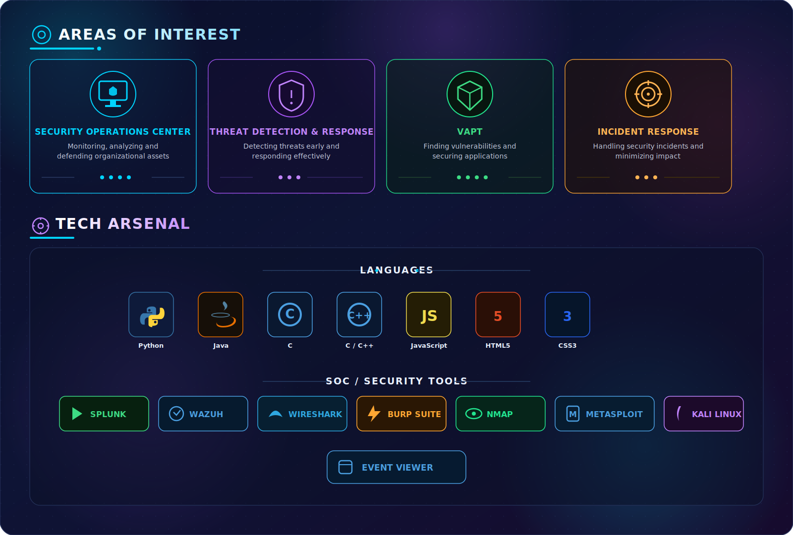
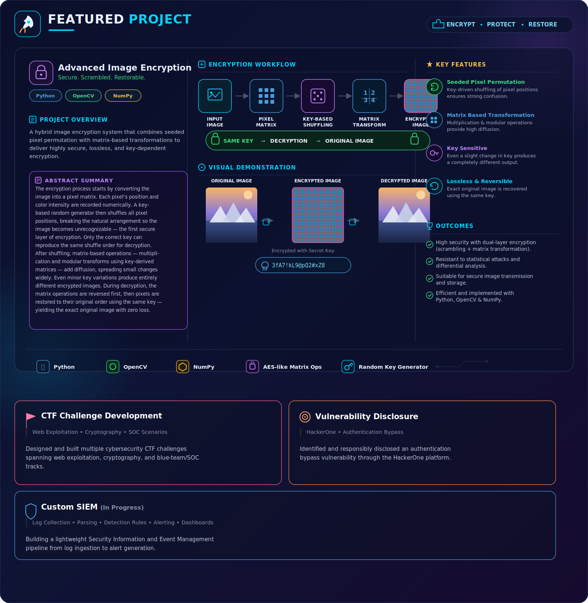
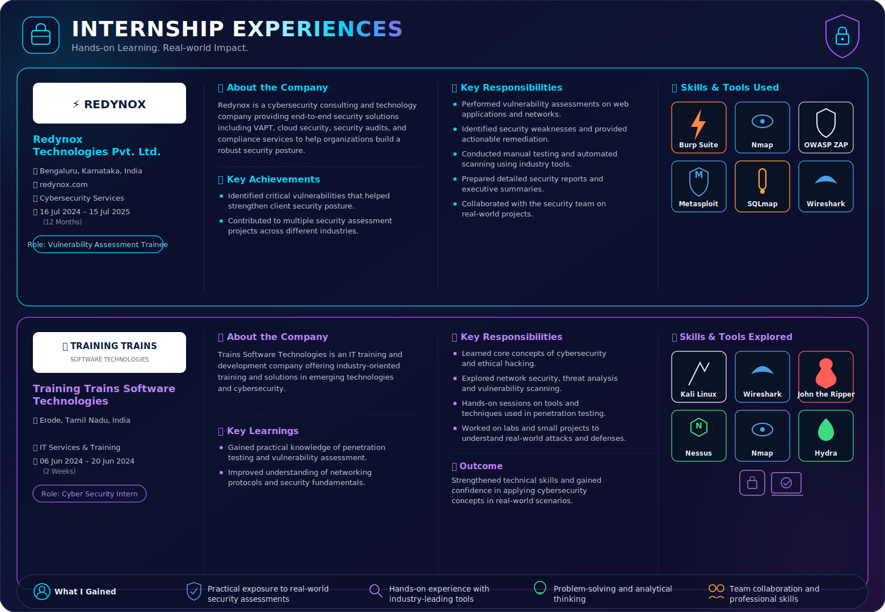
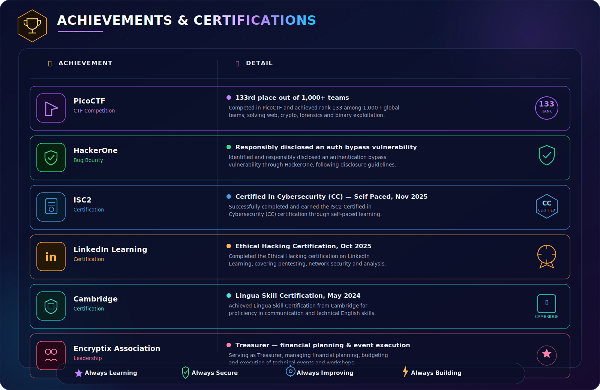

 

 

## 🧑‍💻 About Me

## 🛰️ Areas of Interest &amp; ⚙️ Tech Arsenal

## 🚀 Featured Projects

## 💼 Internship Experiences

## 🏆 Achievements & Certifications

## 📊 GitHub Stats

## 🐍 Contribution Graph — 3D Snake

⚠️ This animation renders automatically once the GitHub Action below is added to your <code>Mukeshk333/Mukeshk333</code> repo — see setup notes at the bottom.

## 📚 Currently Exploring

_v2-4db8ff?style=flat-square&labelColor=0e1435)

### 💬 "Security is not merely a feature; it is a prerequisite for the responsible use of technology."

⭐ Thank you for stopping by — feel free to connect!

